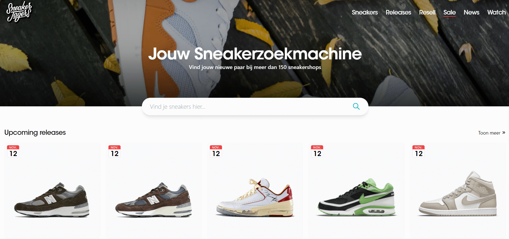

# Procesverslag
Markdown is een simpele manier om HTML te schrijven.  
Markdown cheat cheet: [Hulp bij het schrijven van Markdown](https://github.com/adam-p/markdown-here/wiki/Markdown-Cheatsheet).

In mijn processverslag noteer ik mijn progressie, mijn bevindingen na de wekgroepen/feedbacksessies en noteer ik kort iets over de toegankelijkheidstest.

Versie van document: 1.0

## Jij

uitwerken voor kick-off werkgroep - DONE

### Auteur:
Marijn Molenaar - Klas 202

#### Je startniveau:
Zwart

#### Je focus:
Responsiveness
 

## Je website

uitwerken voor kick-off werkgroep

### Je opdracht:
https://www.sneakerjagers.com/

Voor mijn opdracht ga ik de website van Sneakerjagers namaken, met de focus op responsiveness. 
Ik vind het interessant om hier meer over te weten en hoe responsiveness in zijn werking gaat. 

#### Screenshot(s) van de eerste pagina (small screen): 
Homepagina 

#### Screenshot(s) van de tweede pagina (small screen):
Sneakeroverzicht

 

## Breakdownschets (week 1) - DONE

uitwerken na afloop 2e werkgroep

### de hele pagina: 

### dynamisch deel (bijv menu): 

### wellicht nog een dynamisch deel (bijv filter): 

## Voortgang 1 (week 2)

uitwerken voor 1e voortgang

### Stand van zaken
Ik ben begonnen aan het bouwen van de homepagina. Dit is de basis van mijn project, en ook een beginsel voor de 2e pagina. 
Op het moment van schrijven ben ik alle standaard elementen in de pagina aan het zetten, en ze aan het stijlen en positioneren
met css en flexbox. Voor beiden pagina's ga ik grote blokken met content gebruiken waar doorheen gescrolled kan worden.

Web development kan soms erg lastig zijn. Zelf heb ik al flink wat ervaring met frondedn development, maar soms loop ik ook even vast. 
De opdrachten helpen hier goed bij, omdat je de code ook in actie ziet, en niet alleen maar op een slide waar
het niet zoveel betekend. 

### Agenda voor meeting
samen met je groepje opstellen

| Marijn         | Tessa              | Dana         | Sadie            |
| ---            | ---                | ---          | ---              |
| HTML video     | en dit             | Meerdere     | en dan ik dat    |
| achtergrond img| dit als er tijd is |button styling| dit wil ik zeker |
| ...            | ...                | ...          | ...              |
 

### Verslag van meeting
hier na afloop snel de uitkomsten van de meeting vastleggen

- HTML video: Opgelost
- Achtergrond omg: Nog niet opgelost, ga hier zelf nog achteraan

## Voortgang 2 (week 3)

uitwerken voor 2e voortgang

### Stand van zaken
Het gaat de goede kant op met mijn site. De basis staat nu voor beiden pagina's. Ik ben nu bezig om alle elementen precies goed te positioneren,
en de content aan de site toe te voegen. Maar in principe heb ik nu een solide basis waar ik mee door kan gaan.

Er zijn nog wel wat aandachtspuntjes. Ik ben nu bezig om m.b.v. selectoren alle elementen aan te spreken en de juiste positie te geven. 
Sommige tekstblokjes staan nog niet helemaal recht onder de afbeeldingen, en die wil ik nog goed zien te krijgen. Ook ga ik de kopjes nog
een klein beetje aanpassen, die lijken ook nog niet helemaal op de echte website.

Over het algemeen gaat het goed. Ik heb nog wat to-do's, maar ik ben ervan overtuigd dat ik die allemaal kan aankaarten.

To do:
-Navigatiebalk goed krijgen
-Tekstblok onder sneakerstories sectie rechttrekken aan afbeelding
-Microinteractie toevoegen (zoekbalk of hamburgermenu)
-Site beter responsive maken

### Agenda voor meeting
samen met je groepje opstellen

| student 1      | student 2          | student 3    | student 4        |
| --             | ---                | ---          | ---              |
| dit bespreken  | en dit             | en ik dit    | en dan ik dat    |
| en dat ook nog | dit als er tijd is | nog een punt | dit wil ik zeker |
| ...            | ...                | ...          | ...              |

### Verslag van meeting
hier na afloop snel de uitkomsten van de meeting vastleggen

- HTML volgens de standaard schrijven

## Toegankelijkheidstest (week 4)

uitwerken na test in 8e voortgang

### Bevindingen
Lijst met je bevindingen die in de test naar voren kwamen:

- Toetsenbord: Tab werkt nog niet op afbeeldingen/sneakerblokken, omdat deze elementen nog niet kilkbaar zijn d.m.v. een button of ander klikbaar element
- Parkingson: Mijn website is enigsinds goed te gebruiken omdat de buttons groot zijn. 

- Zichtbeperking: De tekst en afbeeldingen zijn goed zichtbaar met zichtbeperkingen

- Concentratieproblemen: De site is te gebruiken terwijl ik een ballon hooghoud

- Screenreader: De screenreader kan alle elementen op de pagina voorlezen, behalve de footer            

#### TAB toets werkt niet overal
Sommige delen van de site waren niet toegankelijk met de tab toets, omdat die items niet als detecteerbaar element waren gecodeerd, zoals een button of een link. Dit heb ik opgelost door deze elementen waar nodig binnen een  tag te zetten, zodat ze detecteerbaar werden.

#### Motorische handicap 
Ik heb de website getest met de schokband om, die de gevolgen van parkingson moeten simuleren. Uit deze test is gebleken dat de website nog goed te gebruiken is, omdat mijn site veel gebruikt maakt van grote, klikbare vlakken die makkelijk aangeklikt kunnen worden. 

#### Zichtsbeperking
Ik heb de website getest met een aantal zichtbeperkende brillen. Uit deze test is gebleken dat de tekst nog goed leesbaar is, omdat de tekst op een witte achtergrond staat die veel licht afgeeft.

#### Screenreader
Ik heb een screenreader door de website heen laten lezen. Alle klikbare elementen en tekst kan worden afgelezen, behalve die in de footer. Waar dit aan ligt wil ik nog uitzoeken. Het liefst zou ik wel willen dat dit afgelezen kan worden omdat mijn naam hierin staat en ook de bronvermelding van de afbeeldingen.

#### Aanpassingen code

#### Voor de aanpassingen:
Voor de aanpassingen:

Na de aanpassingen:

## Voortgang 3 (week 4)

uitwerken voor 3e voortgang

### Stand van zaken
De basis staat nu, alleen moet ik nog de HTML volgens de standaard indelen. Hiervoor kan ik de w3c validator gebruiken om te testen of alles correct staat. Ook kan ik nog wat onnodige css en HTML code weghalen. Dot optimaliseert mijn site en maakt het bestand kleiner. 

### Agenda voor meeting
samen met je groepje opstellen

| student 1      | student 2          | student 3    | student 4        |
| ---            | ---                | ---          | ---              |
| responsiveness | en dit             | en ik dit    | en dan ik dat    |
| en dat ook nog | dit als er tijd is | nog een punt | dit wil ik zeker |
| ...            | ...                | ...          | ...              |
 

### Verslag van meeting
hier na afloop snel de uitkomsten van de meeting vastleggen

- HTML volgens standaard schrijven
- Naar Responsive gedeelte kijken

## Eindgesprek (week 5)

uitwerken voor eindgesprek

### Stand van zaken
Pluspunten: Ik vond het een interessante opdracht om te doen. Het is altijd goed voor ddn cmd student om front end development goed onder de knie te krijgen. Ik heb veel geleerd over selectoren en verschillende states. Ik zie ook hoe mij dit goed kan helpen met project Web. 

Minpunten: Responsiveness. Ik begrijp hoe het werkt en hoe je het moet toepassen, maar ik vind het nog lastig om het helemaal te perfectioneren m.b.v. breakpoints en hoe je bepaalt waar het breakpoint begint en eindigd. Hier wil ik in de toekomst meer aandacht aan besteden, want dit is wel een belangrijk onderwerp waar je veel van kan profiteren. 

### Screenshot(s)

Screenshots van je eindresultaat

## Herkansingsweek

### Stand van zaken
Naar aanleiding van het eindgesprek heb ik wat feedback ontvangen en deze verwerkt in mijn website. De feedback had vooral te maken met responsiveness, die ik nu verbetert heb. 
Veranderingen die ik heb doorgevoerd:

- Button en navigatie binnen header geplaatst
- Logo toegevoegd
- 2e header toegevoegd voor beide pagina's
- Bovenste koppen veranderd naar H1
- Advertentie binnen section geplaatst
- Upcoming releases binnen section geplaatst
- Laatste nieuws binnen section geplaatst
- Zoekveld binnen section geplaatst
- Andere content binnen footer geplaatst
- 1 ul met meerdere li's voor artikel secties
- Linkjes binnen li tags geplaatst
- Order: -1 gebruikt om voor de artikelen de afbeelding boven de tekst te plaatsen

## Bronnenlijst

continu bijhouden terwijl je werkt

1. https://www.w3schools.com/ - website voor HTML basis
2. https://css-tricks.com/snippets/css/a-guide-to-flexbox/ - Flexbox handleiding
3. https://www.youtube.com/watch?v=ydZc17rlR5E - tutorial voor responsive hamburger menu
4. https://www.youtube.com/watch?v=K74l26pE4YA - Flexbox spoedcursus

